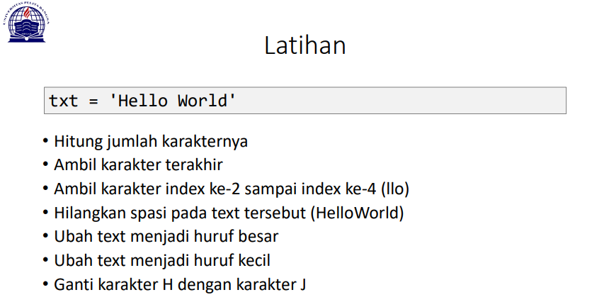
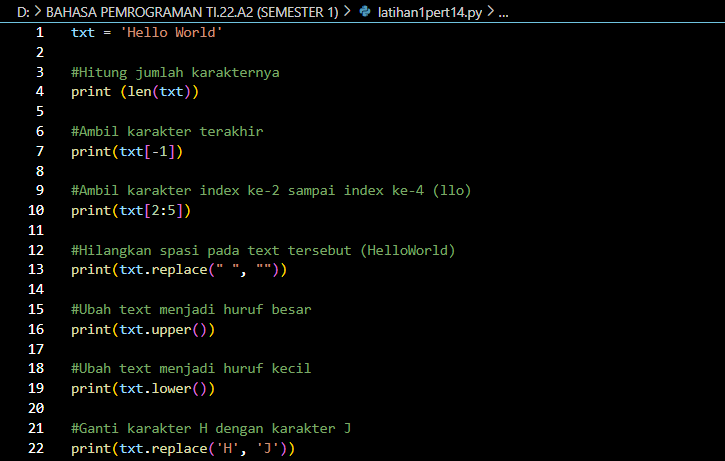
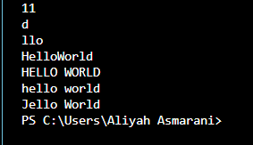
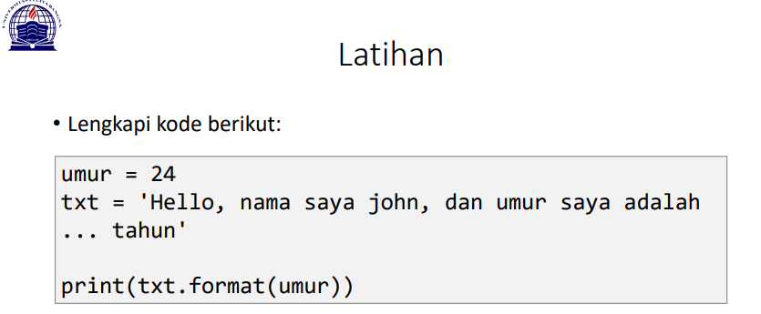
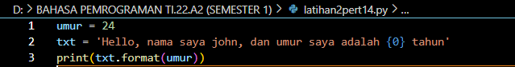
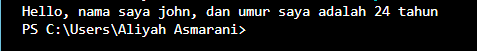

# pertemuan 14 

```s
NAMA    : ALIYAH ASMARANI
NIM     : 312210203
KELAS   : TI.22.A.2
MATKUL  : BAHASA PEMROGRAMAN
```

# LATIHAN 1


## Input


## Output


### Penjelasan Latihan 1
- Menghitung jumlah karakter
    Dalam menghitung jumlah karakter bisa menggunakan fungsi `len` dalam bahasa python. 
    contohnya `len(num)`, dimana len adalah fungsi untuk menghitung jumlah karakter, dan num adalah nilai string.

- Mengambil karakter terakhir
    Cara mengambil satu karakter pada string yaitu dengan menggunakan kurung siku [ ] dan deklarasi nomor di dalam kurung siku dengan urutan ARRAY dan menggunakan titik dua lalu masukan nomor ARRAY selanjutnya.

- Mengambil karakter index ke-2 sampai index ke-4 (llo)
     Untuk mengambil karakter terakhir, gunakan index [-1]. Sedangkan untuk mengambil karakter index ke-2 sampai ke-4, gunakan index [2:5].

- Menghilangkan spasi pada text (HelloWorld)
    fungsi replace() adalah fungsi string python yang umum digunakan. Fungsi replace() menggantikan karakter, kata, atau frasa tertentu dalam frasa tertentu. Berikut adalah sintaks dari fungsi replace() yang digunakan untuk menghilangkan spasi dari string.
    `General syntax: variableName.replace(OldString, NewString, count)`
    VariabelName adalah variabel yang berisi string. OldString adalah kata, karakter, atau frasa yang perlu diubah, dan user harus menyediakannya. NewString adalah kata, karakter, atau frasa baru yang harus menggantikan nilai lama dalam string, dan harus disediakan. Terakhir, hitungan menentukan jumlah kemunculan nilai lama yang harus diganti. Ini opsional; karenanya, jika hitungan tidak disediakan, default akan menggantikan semua kemunculan di OldString.

- Mengubah text menjadi huruf besar
    txt.replace(" ", "") maksudnya adalah mengganti " " yang ada spasinya menjadi "" tidak ada spasinya.

- mengubah text menjadi huruf kecil
    jika ingin mengubah huruf menjadi kecil, gunakan method 'lower()'

- Mengganti karkter H dengan karakter J
    Untuk mengganti karakter 'H' dengan karakter 'J', gunakan method replace().

# LATIHAN 2


## Input  


## Output


### Penjelasan Latihan 2
-   Untuk memasukkan variable ke dalam string, tambahkan kurung kurawal {} untuk menempatkan variable sebelumnya.

``
umur = 24
txt = 'Hello, nama saya john, dan umur saya adalah {0} tahun'
print(txt.format(umur))
``
